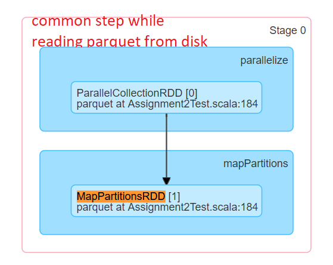
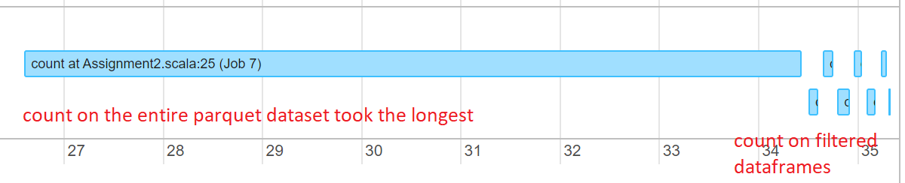
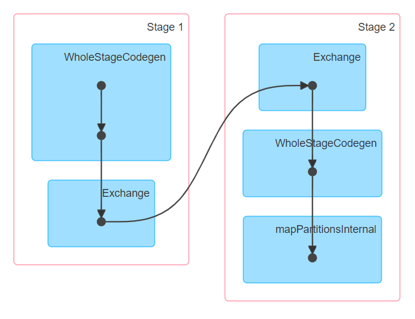
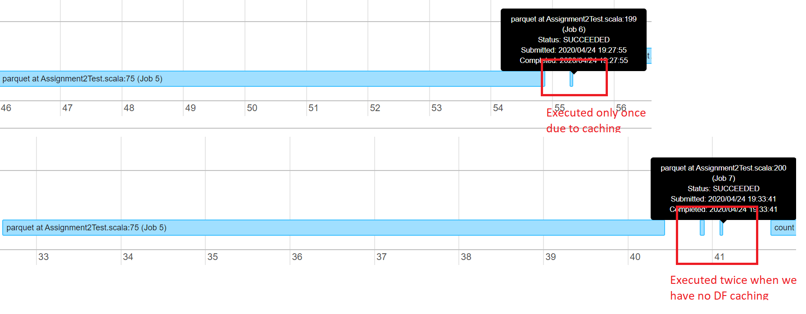

# Spark Assignment
Airline on-time Performance Analysis

## Project Overview
According to the US Federal Aviation Administration (FAA), a flight is considered delayed when it arrives 15 minutes later than its scheduled time. 
With large amounts of flight performance data made publicly available, the assignment postulates that spark data analytics could help gain analytical insight into the causes, trends and comparisons associated with flight delays.
I intend to use only a smaller set of data for this assignment due to the git file size limit. However, the overall dataset for a year is close to 3 GB and hence this is an interesting analytical problem to be solved at scale using Spark analytics.

## Data Overview
Several data sources shall be used for this project. The primary dataset regarding on-time flight performance is from Bureau of Transportation Statistics (BTS). Statistical computing are few other sources of information to augment the primary data set.

| Dataset Source        | Description           | Format  | Size (rows, columns, file size)|
| ------------- |:-------------:| -----:|-----:|
| www.transtats.bts.gov      | This is the primary dataset: On time flight performance for 2019 | CSV |149033, 110, 39MB |
| http://stat-computing.org/dataexpo/2009/plane-data.csv      | Plane Data      |   CSV |5029, 9, 420 KB |
| http://stat-computing.org/dataexpo/2009/carriers.csv | Aircraft carrier      |    CSV |1491, 2, 44 KB |


## Analytical questions
All of the analytical questions are based on three dataframes that map to the three csv files described in the data overview section.<br/>
airlineDataDF - Represents the dataframe created from airline performance csv <br/>
carrierDataDF - Represents the dataframe created from carrier csv<br/>
planeDataDF - Represents the dataframe created from plane csv<br/>
Methods indicated in the analytical questions are from this spark API
https://spark.apache.org/docs/2.4.5/api/scala/index.html#org.apache.spark.sql.Dataset

All of the CSV files are read and dataframe is used to make a equi-join across these three dataframes using the given column name.
The logic is implemented in the beforeAll(..) test method. The parquet files are generated only once and re-used across all the tests.
The parquet file is partitioned based on the airline code and hence the directory structured is fragmented based on the airline code. 

For every test execution, we first read the parquet file from the disk.
Internally, Spark parallelize operation generates the first RDD,  ParallelCollectionRDD.
Finally, a MapPartiionsRDD is created by using mapParitions transformation.

### What is the percentage delay types by total delays?
- Usage:
The driver and executor process is run on the same JVM thread as the code is run in a local mode.
This step shall be common across all tests.<br/>

- Spark Internals:

Step 1: A job is created to read the parquet file from the disk<br/>
Step 2: A job is run for the first count operation on the entire dataframe, this step took the longest<br/>
Step 3: Multiple jobs are created when we execute the count function on the filtered dataframes <br/><br/>



### What is the min/max/average delays for an airline in a month and year?
- Usage:
Group by multiple columns such as airline type, month or year and then apply aggregation function to calculate min,max, and average.<br/>
filter(..) function is used to first filter the datasets that represent delayed flights for delta airlines <br/>
groupBy(..,..) is done on reporting airline and flight date.

### Did privately managed airlines perform better than publicly traded ones?
- Usage:

I have utilized the UDF (user defined function) to generate a new column "ownership" based on a custom function airline_ownership(..) <br/>
A filter(..) operation is then applied to filter by ownership = 'Public' or ownership = 'Private'.
Finally, a count is done on the filtered dataset to compare delay counts.
Since, spark DataFrame transformations are immutable, the withColumn function results in creation of a new dataframe airlineDataWithOwnership with the new column "ownership".

- Spark Internals:



Two stages are created for each filter and count() operation on the dataframe :

In Stage 1, FileScanRDD, which is an RDD of internal binary rows is created, the output of this results in the creation of MapPartitionsRDD. 

In stage2, a shuffledRDD is created to shuffle data over the cluster as we do a filter transformation on the dataframe
Since we use filter here, it is a narrow narrow transformation and hence data is not shuffled from one partition to another.
Finally, a count() function results in execution of an action and hence the actual execution of the plan takes place at this stage.

### What delay type is most common at each airport?
- Usage:
The dataframe is filtered to create multiple dataframes based on the airline delay type. There are five different delay types:
Carrier, Weather, NAS, Security and LateAircraft.
Syntax to filter out the rows based on the delay type is as follows:
NOTE: 
CarrierDelay will be replaced with appropriate delay column for the delay type. Also, we are inlcuding an additional condition to filter out records at the MSP airport only.

After filter, a groupBy by origin column and count action returns the number of records. We finally, return the top 1 record as we are only interested in comparing the top 1 delays.
 
```sql
ArrDel15 > 0 and CarrierDelay > 0 and Origin = 'MSY'
```

 
Filter airlineDataDF by airport and then group by delay type to count delay types for each airport
I will make use of filter(..) by column and groupBy(..,..) function for this implementation.

- Spark Internals:

### Did airlines with modernized fleet perform better?
- Spark Internals:

Step 1: A job is created to read the parquet file from the disk<br/>
Step 2: A job is run for the first count operation after the filter query on the dataframe. The job has two tasks that run in parallel to complete the task<br/>
Step 3: Step 2 is repeated for the second dataframe<br/><br/>



## Code Overview

### Test

`Assignment2Test.scala` is a test for the Spark driver. 


## Running Tests

### From Intellij

Right click on `Assignment2Test` and choose `Run 'Assignment2Test'`

### From the command line

On Unix systems, test can be run:

```shell script
$ ./sbt test
```

or on Windows systems:

```shell script
C:\> ./sbt.bat test
```

